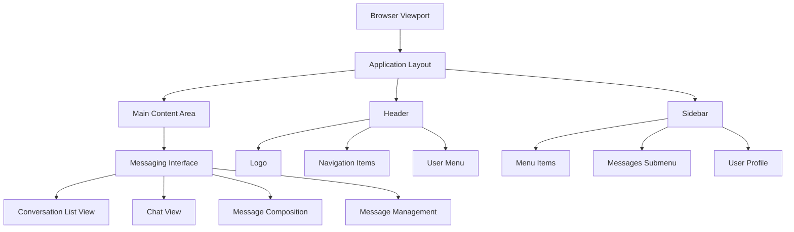

# Messaging Interface Layout Structure

## Overview
This document describes the layout structure of the messaging interface to ensure it integrates properly with the existing header and sidebar without overlapping or stacking issues.

## Layout Structure



## Z-Index Hierarchy

1. **Main Content Area** (z-index: auto) - Base layer
2. **Header** (z-index: 1000) - Stays on top
3. **Sidebar** (z-index: 900) - Below header but above content
4. **Messaging Interface** (z-index: auto) - Content layer
5. **Dropdowns/Modals** (z-index: 1100+) - Above all

## Dimension Constraints

### Header
- Fixed height: 64px (h-16)
- Full width of viewport
- Positioned at top with `position: relative`

### Sidebar
- Width: 256px (w-64) on desktop
- Full height of viewport
- Hidden on mobile by default
- Positioned on left edge

### Main Content Area
- Positioned to the right of sidebar
- Below the header
- Takes remaining viewport space
- Padding: 1rem (p-4) on all sides

### Messaging Interface Dimensions
- Maximum height: `calc(100vh - 200px)` for chat views
- Conversation list: 1/3 or 1/4 of width on desktop
- Chat area: remaining width on desktop
- Full width on mobile

## Responsive Behavior

### Desktop (> 1024px)
```
┌─────────────────────────────────────────────────────────────┐
│  Header (64px height)                                       │
├─────────────────┬───────────────────────────────────────────┤
│                 │                                           │
│  Sidebar        │                                           │
│  (256px width)  │    Messaging Interface                    │
│                 │                                           │
│                 │                                           │
└─────────────────┴───────────────────────────────────────────┘
```

### Tablet (768px - 1024px)
```
┌─────────────────────────────────────────────────────────────┐
│  Header (64px height)                                       │
├─────────────────────────────────────────────────────────────┤
│                                                             │
│                    Messaging Interface                      │
│                                                             │
└─────────────────────────────────────────────────────────────┘
```

### Mobile (< 768px)
```
┌─────────────────────────────────────────────────────────────┐
│  Header (64px height)                                       │
├─────────────────────────────────────────────────────────────┤
│                                                             │
│                    Messaging Interface                      │
│                                                             │
└─────────────────────────────────────────────────────────────┘
```

## CSS Classes for Layout Management

### Container Classes
- `w-full` - Full width for main container
- `h-[calc(100vh-200px)]` - Height calculation for chat areas
- `flex` - Flexbox layout for split views
- `rounded-xl` - Rounded corners for containers
- `shadow-lg` - Shadow for depth

### Responsive Classes
- `md:w-1/3` - Width on medium screens and up
- `lg:w-1/4` - Width on large screens and up
- `md:flex` - Flex display on medium screens and up
- `md:hidden` - Hidden on medium screens and up

### Spacing Classes
- `p-4` - Padding for content areas
- `m-4` - Margin for separation
- `gap-4` - Gap between flex items
- `space-y-4` - Vertical spacing between elements

## Implementation Guidelines

### 1. Positioning
- Use `relative` positioning for main containers
- Avoid `fixed` positioning that might conflict with header/sidebar
- Use `z-index` only when necessary and keep values low

### 2. Sizing
- Use `calc()` functions for dynamic height calculations
- Ensure containers don't exceed viewport boundaries
- Use percentage-based widths for responsive behavior

### 3. Overflow Management
- Use `overflow-hidden` on main containers
- Use `overflow-y-auto` on scrollable content areas
- Set appropriate max-height values

### 4. Border Management
- Use `border-r` for right borders on conversation lists
- Use `border-b` for bottom borders on headers
- Use `border-t` for top borders on footers

This layout structure ensures that the messaging interface integrates seamlessly with the existing application layout without overlapping or stacking issues.
